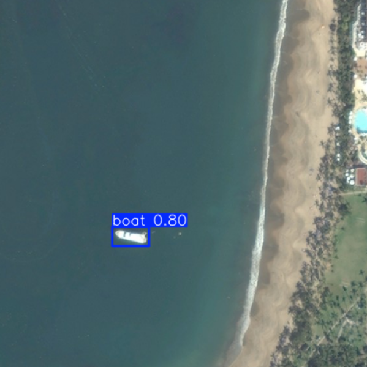

## Autores

- Marcos Blanco Vigo  
- Gonzalo Bobillo Rincón 


# 🚢 Ship Detection from Aerial Images

Este proyecto tiene como objetivo aplicar técnicas de **Análisis Exploratorio de Datos (EDA)**, **Machine Learning clásico**, y **Deep Learning** para resolver el problema de la **detección de barcos en imágenes aéreas**. Utilizamos un dataset proveniente de Kaggle que contiene imágenes aéreas del mar con barcos visibles, con el fin de:

- Clasificar imágenes según presencia de barcos  
- Detectar la ubicación de los barcos en las imágenes   

---

## 📦 Requisitos

Crea un entorno con Python 3.12.

Instala las dependencias necesarias con:

```
pip install -r requirements.txt
```

O si usas Anaconda:

```
conda env create --file requirements.txt
```

Además, deberás instalar la librería pytorch y torchvision según tu sistema operativo y GPU. Puedes encontrar las instrucciones en la [página oficial de PyTorch](https://pytorch.org/get-started/locally/).

---

## 📁 Estructura del Proyecto

```
ship-detection-project/
│
├── data/ 
|   ├── generation/                       
│   └── MASATI/                      
│       ├── output
│           ├── test
│                ├── images              # Imágenes de test
│                └── labels              # Etiquetas de las fotos de test
│           ├── train
│                ├── images              # Imágenes de train
│                └── labels              # Etiquetas de las fotos de train
│           └── val             
│                ├── images              # Imágenes de validation
│                └── labels              # Etiquetas de las fotos de validation
│
├── code/                   
│   └── Code.ipynb                       # Código completo
│
├── requirements.txt                     # Librerías necesarias
├── data.yml                             # Estructura del dataset
└── README.md                            # Documentación principal
```

Debido al gran tamaño del dataset, no se incluye en su totalidad en el repositorio. Para replicar el entrenamiento de los modelos, puedes descargarlo desde [Kaggle](https://www.kaggle.com/datasets/louisaberdeen/masati-v2/data) y descomprimirlo en la carpeta `data`.

---

## 📊 Análisis Exploratorio de Datos (EDA)

Se realizó un análisis detallado de las imágenes del dataset:

- **Distribución de tamaños** de imágenes (ancho, alto)  
- **Distribución de clases** (presencia o ausencia de barcos, así como el número de barcos por imagen)  
- **Histogramas de color** para entender los valores RGB predominantes

> 📌 Este paso permite definir las transformaciones necesarias para los modelos y comprender posibles problemas como el desbalanceo de clases o tamaños dispares.

---

## 🤖 Machine Learning Clásico

Como baseline, se probaron modelos de clasificación simples con extracción de características tradicionales:
  
- Modelo evaluado: Support Vector Machine (SVM)  

> 🔍 Este modelo sirve como línea base para comparar el desempeño de los modelos de Deep Learning posteriores.

---

## 🧠 Deep Learning - Clasificación de Imágenes

Entrenamos modelos de redes neuronales convolucionales (CNN) para clasificar imágenes:

### Modelos

- **CNN desde cero** con Keras/TensorFlow

### Evaluación

- Curvas de **accuracy y loss**  
- Evaluación de **overfitting** y regularización  
- Métricas: precisión, recall, F1-score  

---

## 🕵️‍♀️ Deep Learning - Detección de Objetos

Implementamos detección de barcos en imágenes usando modelos de object detection:

- **YOLOv8 y YOLOv11** con PyTorch

Se utilizaron los modelos de tamaño nano (el más pequeño dentro de la familia YOLO), para optimizar el rendimiento y la velocidad de inferencia. Estos modelos son ideales para tareas de detección de objetos en tiempo real.

### Fine-tuning

- Ajuste de hiperparámetros y técnicas de **data augmentation** para mejorar el rendimiento del modelo.
- Implementación de **transfer learning** para aprovechar modelos YOLO preentrenados.

### Evaluación

Mediante el uso de la métrica **mAP (mean Average Precision)**, se evaluó el rendimiento de los modelos en el conjunto de test. 

El modelo ganador fue el YOLOv8n, que logró un mAP de 0.82 en el conjunto de test, superando ligeramente a YOLOv11n por solamente una centésima de punto.



---

## Generación de imágenes sintéticas

Se ha usado un AutoEncoder para generar imágenes sintéticas. Un AutoEncoder es una red neuronal que aprende a codificar y decodificar datos, permitiendo la generación de nuevas muestras similares a las originales.

El autoencoder ha sido capaz de aprender a generar imágenes del mar, aunque a muy baja resolución (64 x 64 píxeles).  Se puede encontrar un ejemplo del output en la ruta `code/imagenes_generadas`, que junta 16 imágenes.

Un aspecto a mejorar es el pequeño número de imágenes que se usaron para el entrenamiento, ya que el autoencoder necesita un gran número de imágenes para aprender a generar imágenes realistas. En este caso, se usaron 30 imágenes, lo que es muy poco.
Esto se debe a las limitaciones de tiempo y recursos, pero en un caso real se podría usar un conjunto de datos más grande para obtener mejores resultados.
